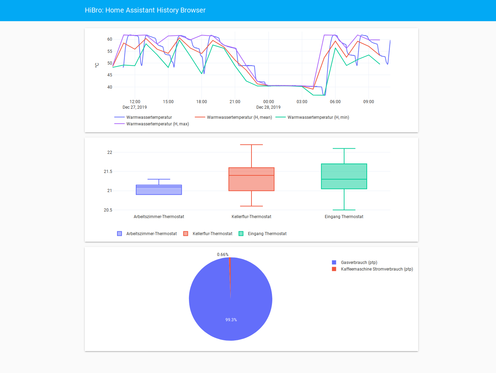

# HiBro: a standalone history browser for Home Assistant


HiBro is a standalone history browser for Home Assistant based on [Plotly Dash](https://plot.ly/dash/).
It displays graphs based on a history database and allows to specify the graphs to be shown with a YAML cofiguration file similar in format to Home Assistant configuration files.

In addition to plain time series graphs, it also allows to apply basic statistical operations to the time series, like mean (or max or min) values in specified time intervals (e.g. hourly or daily). Box plots showing statistics about the value of a sensor and pie charts that can be used to monitor energy consumption, for instance, are also supported.

Further graph types are straightforward to add using Dash & Plotly. Pull requests are welcome.




## Installation

```
python3 -m pip install --user hibro
```

## Quick start

Generate a file named `hibro-config.yaml` and fill it following the instructions below. Minimal example:

```yaml
db_url: "sqlite:////path/to/home-assistant_v2.db"
elements:
  - type: line
    entities:
      - sensor.some_entity
```

Then run `hibro` (or `python3 -m hibro`) and access the dashboard at http://127.0.0.1:8456.

## Configuration

A full configuration file looks like:


```yaml
db_url: ...
title: ...
elements:
  - type: ...
    entities:
      - ...
      ...
  - type: ...
    entities:
      - ...
      ...
  ...
```

Top-level keys:

- `db_url: ` (string, required) A database URI. See the [Home Assistant recorder docs](https://www.home-assistant.io/integrations/recorder/) for details.
- `title: ` (string, optional) A title overriding the default one.
- `elements: ` (list, required) The list of graphs.

There are currently three valid values for "type": `line`, `box`, or `pie`.

The items in the entity lists can either be strings or mappings to specify further options:

```yaml
entities:
  - sensor.my_sensor
  - entity: sensor.my_sensor
    resample: D
```
Like in this example, you can mix both styles in a single list.

### Line charts

A line chart (`type: line`) by default (when given a list of entities) shows a line chart of the entities' states for the past 24 hours. This can be customized by specifying the list items as mappings rather than strings with the following possible keys:

- `duration: ` (optional, mapping) Specify the time interval (from now to the past) for which to display data. Defaults to 24 hours. values have to be specified by a mapping, e.g.:
```yaml
duration:
  hours: 3
```
(also `days` or `minutes` work).
- `attribute: ` (optional, string) Specify a numerical attribute to plot instead of the state itself.
- `resample: ` (optional, string) Specify a time interval to resample the data to. This is useful for instance when looking at finely grained data (seconds or minutes) over a long time period (days). The strings must be in the format of pandas time offset strings, see [the documentation](https://pandas.pydata.org/pandas-docs/stable/user_guide/timeseries.html#dateoffset-objects) for details. Examples: `D` for daily, `H` for hourly.
- `aggregate: ` (optional, string) When resampling data, this is the aggregate function applied to each interval. Defaults to `mean`, i.e. the data will be averaged over the interval. Possible other values include `median`, `min` or `max` (with obvious meanings) or `ptp` ("peak to peak", the difference between maximum and minimum).

Full example:

```yaml
- type: line
  entities:
    - entity: climate.living_room
      attribute: current_temperature
      resample: '15min'
      aggregate: max
      duration:
        hours: 12
    - sensor.outdoor_temperature
```


### Box plots

Box plots (`type: box`) show the median and quartiles of numerical sensor data for the entire time period. It supports the `attribute` and `duration` arguments just as line charts, but resampling and aggregation does not make sense.

Full example:

```yaml
- type: box
  entities:
    - entity: climate.living_room
      attribute: current_temperature
      duration:
        hours: 12
    - sensor.outdoor_temperature
```

### Pie charts

Pie charts (`type: pie`) show aggregated values of numerical sensors for the entire time period as pieces of a pie. This makes sense especially for energy sensors to display the fraction of total energy consumed by a device.
Pie charts also have `attribute` and `duration` options (but no `resample` option). The `aggregate` option in this case refers to the function applied over the entire time period. By default, this is `ptp` (peak to peak), i.e. the difference between the minimum and maximum value. This makes sense for energy sensors where it returns the total energy consumed.

Full example:

```yaml
- type: pie
  entities:
    - entity: sensor.some_device
      attribute: power_consumption
      duration:
        hours: 12
      aggregate: ptp
    - sensor.some_device_energy
```
